### Theory

# Introduction to Virtual Reality

## What is Virtual Reality?
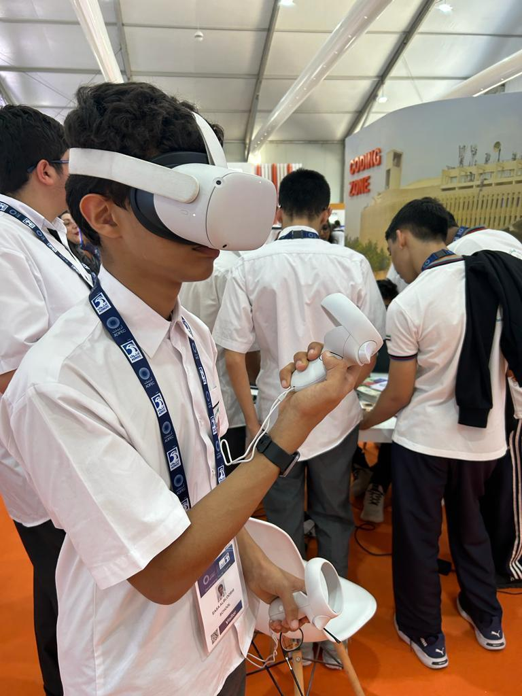

### Definition

Virtual Reality (VR) is the fusion of two contrasting words, 'virtual' and 'reality,' encapsulating the essence of the experience it offers. It entails immersing oneself in a simulated world that feels convincingly real, facilitated by technology that tricks our senses into believing we inhabit an alternate reality. In essence, VR enables the sensation of genuine presence within a fabricated yet lifelike environment.

In other words, Virtual Reality (VR) is a computer-generated simulation of an environment or experience that immerses users in a three-dimensional, interactive world. It's designed to stimulate the senses, creating an artificial environment that can be explored and interacted with as if it were real. VR typically involves the use of a headset or goggles that display a virtual environment to the user, often coupled with specialized gloves or controllers to enable interaction withinesasdas that environment. This technology has applications in gaming, education, training, healthcare, and various other industries, offering immersive and often highly engaging experiences.

## Components of VR

The detailed breakdown of the components that make up a typical Virtual Reality (VR) system:

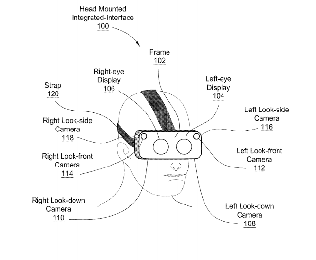

NVIDIA VR Headset Patent Found - PC Perspective

### 1. Head-Mounted Display (HMD)
- The HMD is the primary hardware for VR, worn on the head like goggles or a helmet.
- It contains small screens or lenses to display stereoscopic 3D images, creating the visual experience.
- Some HMDs also have built-in sensors for head tracking, allowing the system to adjust the displayed images based on the user's movements.

### 2. Tracking System
- Sensors or cameras track the user's movements and location in physical space.
- **Inside-out tracking**: Uses sensors on the HMD to monitor the user's movements without external devices.
- **Outside-in tracking**: Relies on external cameras or sensors placed in the environment to track the user's position and movements.

### 3. Controllers and Input Devices

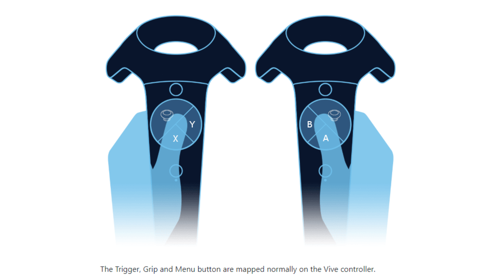

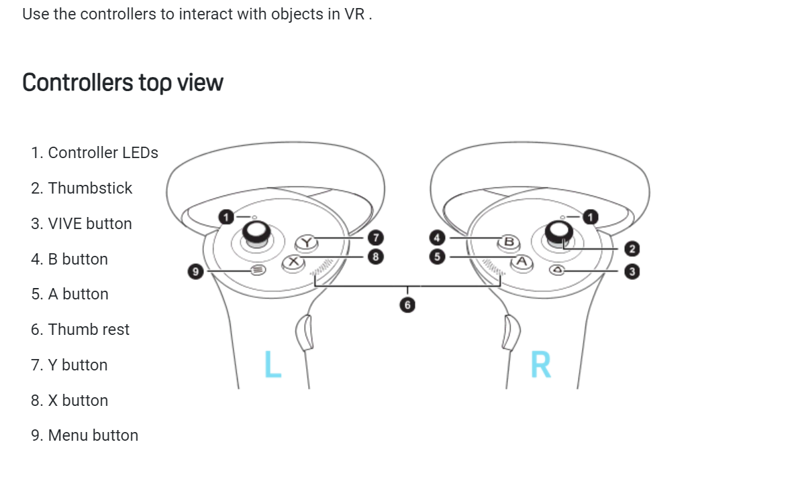

- Handheld controllers or gloves allow users to interact with the virtual environment.
- These devices can simulate hand movements, gestures, and manipulation of objects within the VR space.

### 4. Audio System
- Quality audio output enhances immersion by providing spatial, 3D audio cues.
- Surround sound headphones or speakers create a sense of presence by delivering realistic sounds from different directions.

### 5. Graphics Processing Unit (GPU)
- Powerful computers or devices equipped with high-end GPUs render high-quality, real-time graphics for a smooth and immersive experience.
- GPUs handle the complex calculations required to generate the detailed visuals in VR.

### 6. Software and Applications
- VR experiences, games, simulations, and applications specifically designed for VR.
- These programs run on compatible platforms and offer a wide range of virtual experiences.

### 7. Haptic Feedback Devices

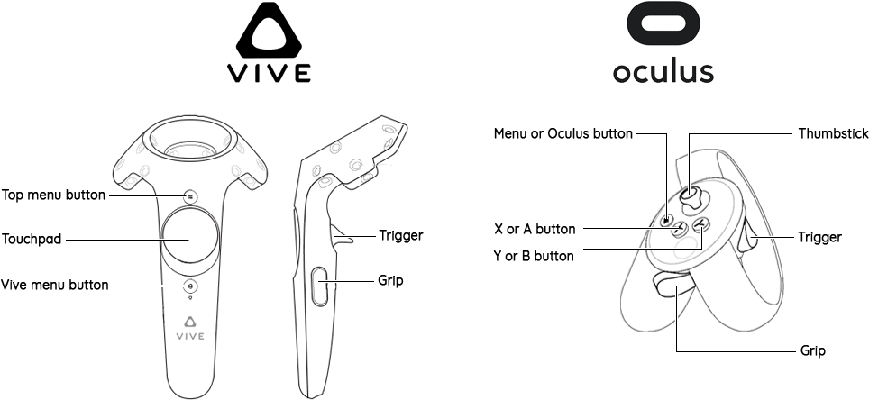

- Haptic technology provides tactile feedback, allowing users to feel sensations within the virtual environment.
- Devices such as gloves or vests use vibrations, pressure, or other methods to simulate the sense of touch.

### 8. Peripherals & Cables

- **USB Type-C**

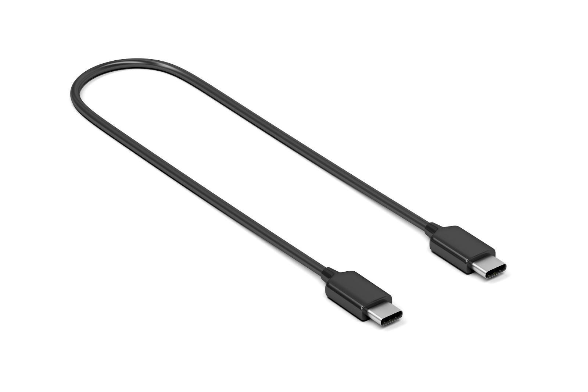

- **HDMI/Mini Display Port/Display Port Cable**

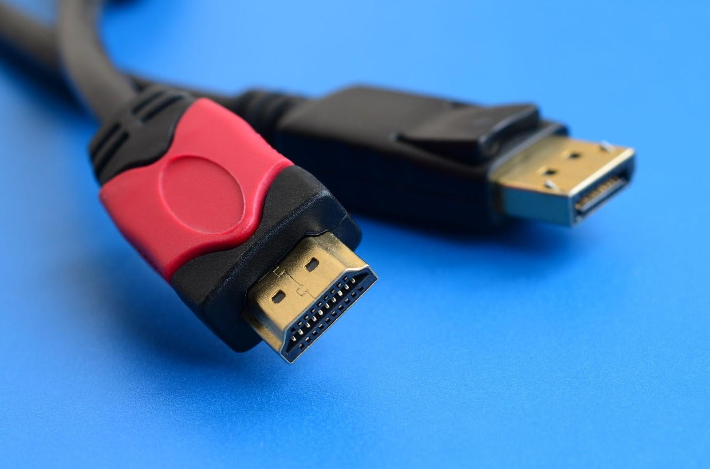
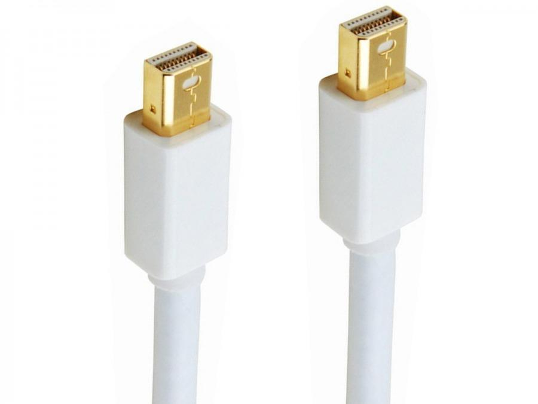

- **MicroUSB**

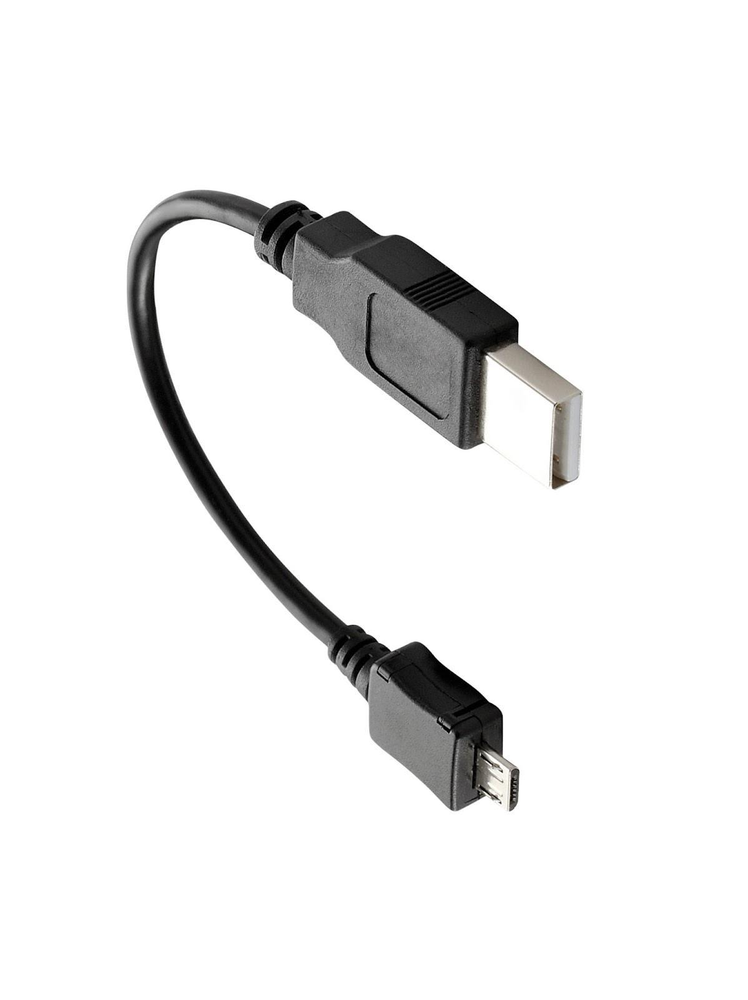

- **WiFi**

- **Input and Output Connector (I/O Hub)**

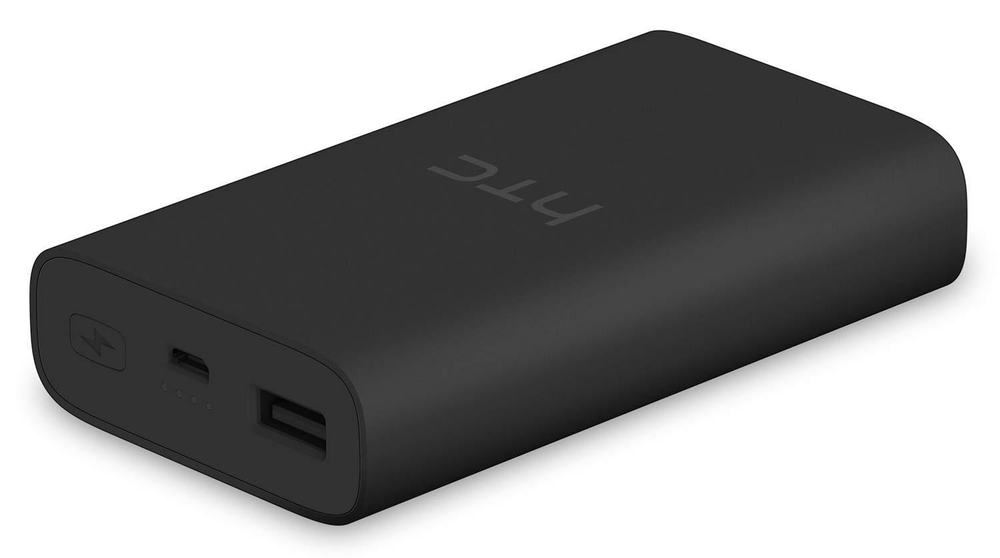
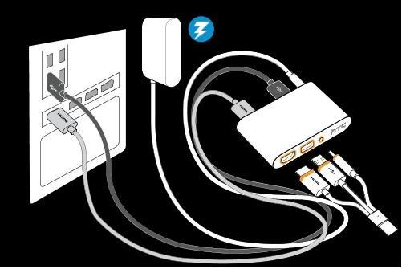