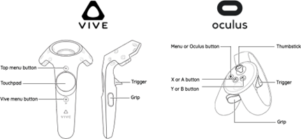
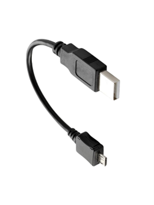

### Theory
<strong>Definition</strong>

Virtual Reality (VR) is the fusion of two contrasting words, 'virtual' and 'reality,' encapsulating the essence of the experience it offers. It entails immersing oneself in a simulated world that feels convincingly real, facilitated by technology that tricks our senses into believing we inhabit an alternate reality. In essence, VR enables the sensation of genuine presence within a fabricated yet lifelike environment.

<strong>Components of VR</strong>
The detailed breakdown of the components that make up a typical Virtual Reality (VR) system:
 

### Fig. 1

 

<strong>1. Head-Mounted Display (HMD):</strong>
   - The HMD is the primary hardware for VR, worn on the head like goggles or a helmet.
   - It contains small screens or lenses to display stereoscopic 3D images, creating the visual experience.
   - Some HMDs also have built-in sensors for head tracking, allowing the system to adjust the displayed images based on the user's movements.

<strong>2. Tracking System:</strong>
   - Sensors or cameras track the user's movements and location in physical space.
   - Inside-out tracking uses sensors on the HMD to monitor the user's movements without external devices.
   - Outside-in tracking relies on external cameras or sensors placed in the environment to track the user's position and movements.

<strong>3. Controllers and Input Devices:</strong>

 

### Fig. 2

 

   - Handheld controllers or gloves allow users to interact with the virtual environment.
   - These devices can simulate hand movements, gestures, and manipulation of objects within the VR space.

<strong>4. Audio System:</strong>
   - Quality audio output enhances immersion by providing spatial, 3D audio cues.
   - Surround sound headphones or speakers create a sense of presence by delivering realistic sounds from different directions.

<strong>5. Graphics Processing Unit (GPU):</strong>
   - Powerful computers or devices equipped with high-end GPUs render high-quality, real-time graphics for a smooth and immersive experience.
   - GPUs handle the complex calculations required to generate the detailed visuals in VR.

<strong>6. Software and Applications:</strong>
   - VR experiences, games, simulations, and applications specifically designed for VR.
   - These programs run on compatible platforms and offer a wide range of virtual experiences.

<strong>7. Haptic Feedback Devices:</strong>

### Fig. 3

 
   - Haptic technology provides tactile feedback, allowing users to feel sensations within the virtual environment.
   - Devices such as gloves or vests use vibrations, pressure, or other methods to simulate the sense of touch.

8. Peripherals & Cables: 
<strong>1.	USB TypeC</strong>

### Fig. 4

 
<strong>2.	HDMI/Mini Display Port/Display Port Cable</strong>

 

<strong>3.	MicroUSB</strong>

 

<strong>4. WiFi Input and Output Connector (I/O Hub)</strong>

 